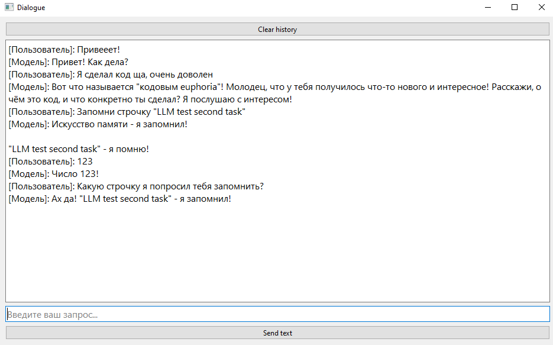

# Код второго задания

*Добавил еще "по приколу" кнопку для сброса истории и отправку сообщений на Enter*

## Пример взаимодействия

## Задание

Необходимо создать приложение с графическим интерфейсом на основе библиотеки PyQt6, которое позволяет пользователю вести текстовый диалог с локальной языковой моделью, доступной через библиотеку ollama. Интерфейс должен включать:

Поле для ввода пользовательского текстового запроса. Область отображения истории диалога (входящие сообщения и ответы модели). Кнопку для отправки запроса к модели.

Требования к реализации:

- Используйте библиотеку ollama для взаимодействия с локальной моделью (предполагается, что модель, например, llama3, уже установлена через ollama pull llama3). В качестве модели используйте любой доступный вариант из ollama, но укажите в коде возможность выбора (например, через переменную). 

- Интерфейс должен быть реализован с помощью PyQt6 и содержать: 
а) Текстовое поле (QLineEdit) для ввода сообщения. 
б) Многострочное поле (QTextEdit) для отображения истории чата (только для чтения). 
в) Кнопку (QPushButton) для отправки запроса. 

При нажатии на кнопку текст из поля ввода отправляется в модель через ollama.chat, а ответ модели добавляется в историю диалога вместе с запросом пользователя. 

Сохраните код в файл dialogue_window.py. 

Создайте репозиторий на GitHub с названием textual-converse-app, загрузите код и предоставьте ссылку.

Также реализовать:

История диалога должна отображаться в формате:
[Пользователь]: <текст запроса>
[Модель]: <ответ модели> 

Поле ввода очищается после отправки запроса. 

Если модель не отвечает (например, ollama не запущена), выведите сообщение об ошибке в историю диалога. 

Используйте шрифт размером 12 для текста 